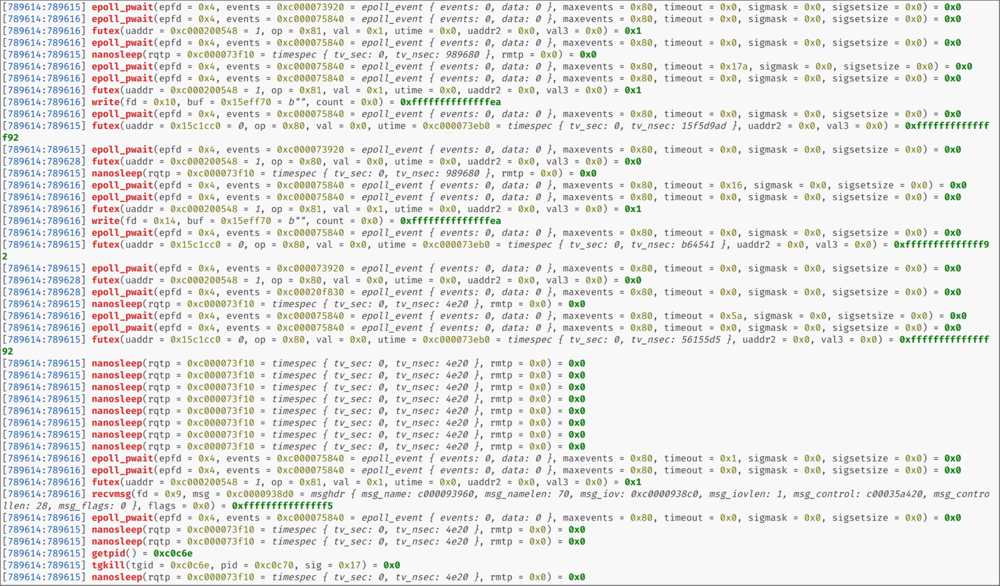

# eStrace

eStrace(eBPF syscall trace) is a tool that traces system calls using eBPF. Compared to strace, it is more flexible and harder to detect. It currently supports two architectures: x86_64 and aarch64. With eStrace, you can conveniently debug and analyze your Linux/Android applications.

## Usage

```bash
sudo ./estrace --help
Usage: estrace [OPTIONS]

Options:
  -p, --pid <PID>        Target pid
  -t, --tid <TID>        Target tid
  -u, --uid <UID>        Target uid
  -f, --filter <FILTER>  filter(split by ','). All possible values: NETWORK,FSTAT,DESC,MEMORY,SIGNAL,STATFS_LIKE,IPC,PROCESS,STAT_LIKE,FSTATFS,LSTAT,STATFS,CREDS,FILE,PURE,CLOCK,STAT
  -h, --help             Print help
```


## Building

### Setup

```bash
cargo install bpf-linker
```
And for android:
```bash
rustup target add aarch64-linux-android
cat << EOF
[target.aarch64-linux-android]
linker = "<SDK>/Sdk/ndk/<NDK Version>/toolchains/llvm/prebuilt/linux-x86_64/bin/aarch64-linux-android30-clang"
EOF >> ~/.cargo/config.toml
```

### Build
```bash
cargo xtask build
cargo xtask build --arch aarch64-linux-android
```
### Build and Run
```bash
cargo xtask run -- <args>
```

## ToDo

- Parse the structure of parameters.
- Support for additional architectures.
